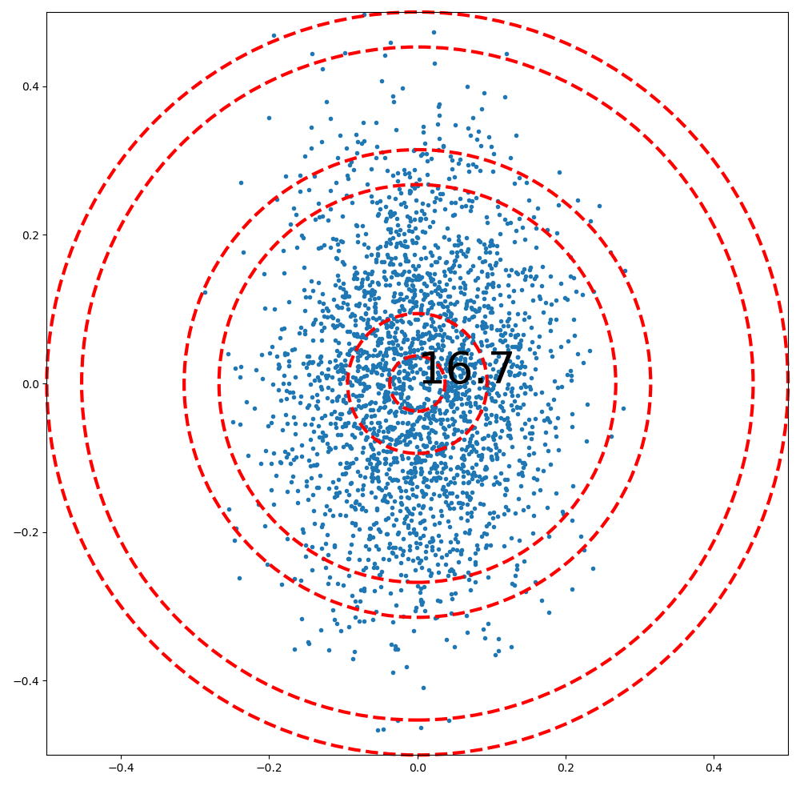
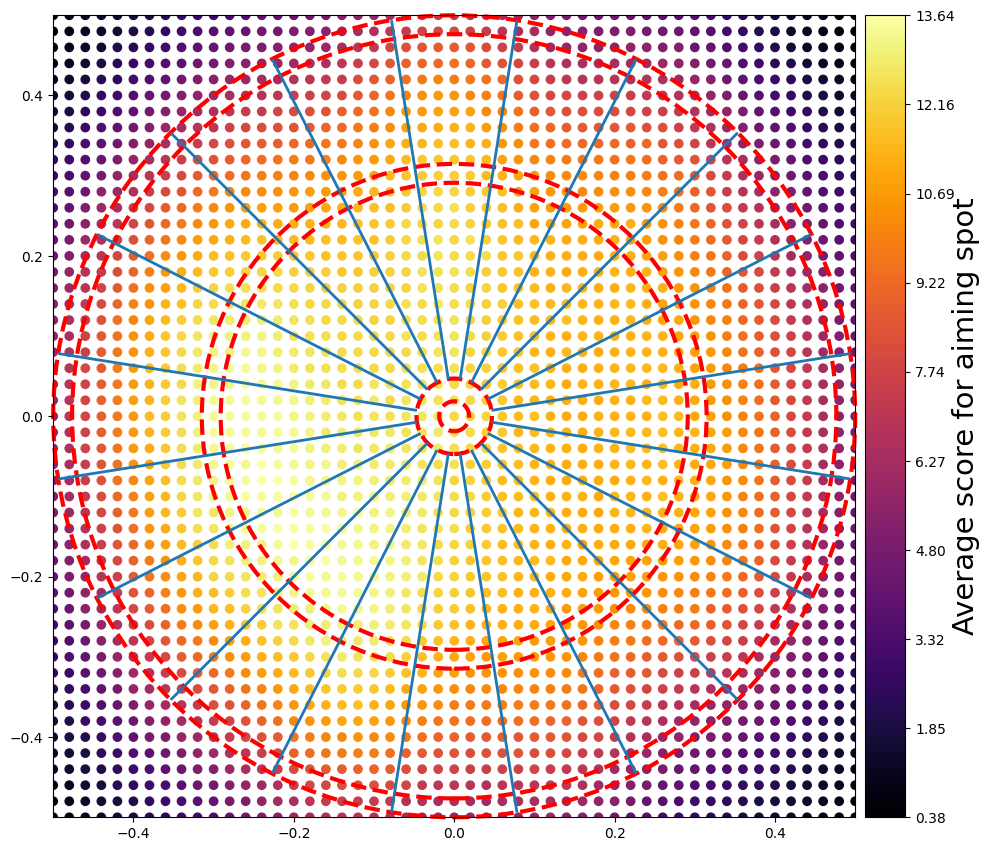
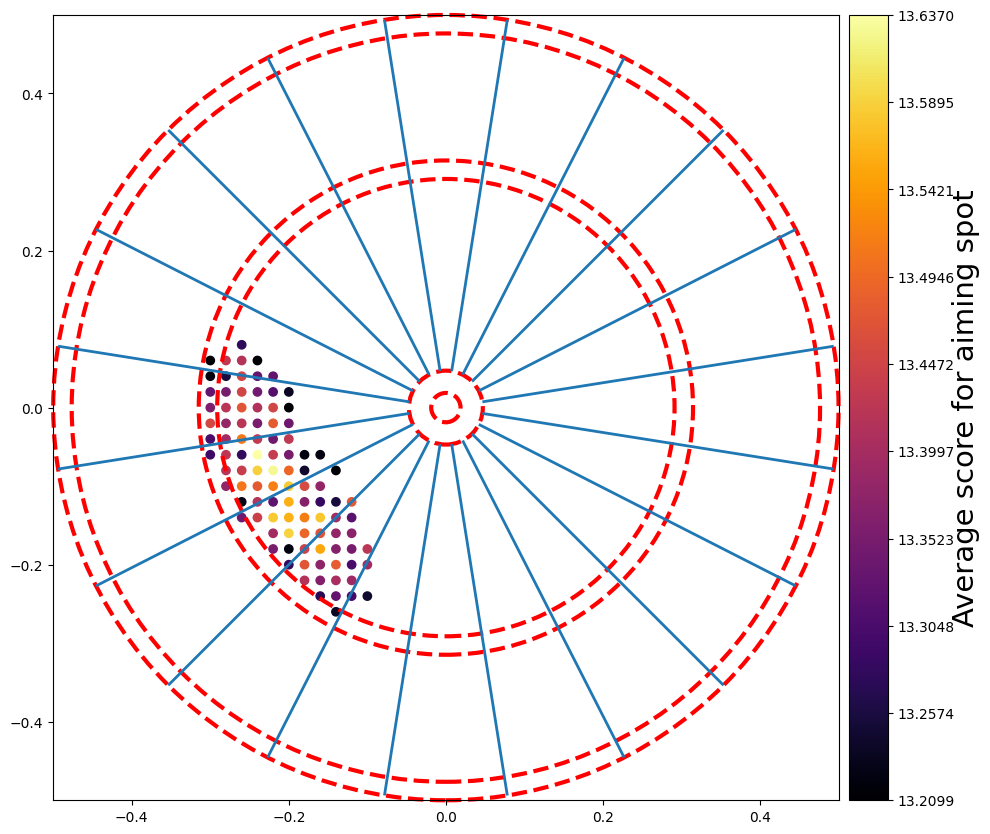

With sigma_x=0.15 and sigma_y=0.09, a player that aims at the middle would get something like:

Knowing this, where should the player aim at to maximize the score per throw?

The answer is: aim at the middle, unless you're exceptionnally good, then aim at the triple 20.

# References and articles about this subject
https://pages.cs.wisc.edu/~bolo/darts/x01.html

https://commons.wikimedia.org/wiki/File:Optimal_Dart_Throw_Location_Skill_Level.svg

https://www.stat.cmu.edu/~ryantibs/darts/

https://www.stat.cmu.edu/~ryantibs/papers/darts.pdf

