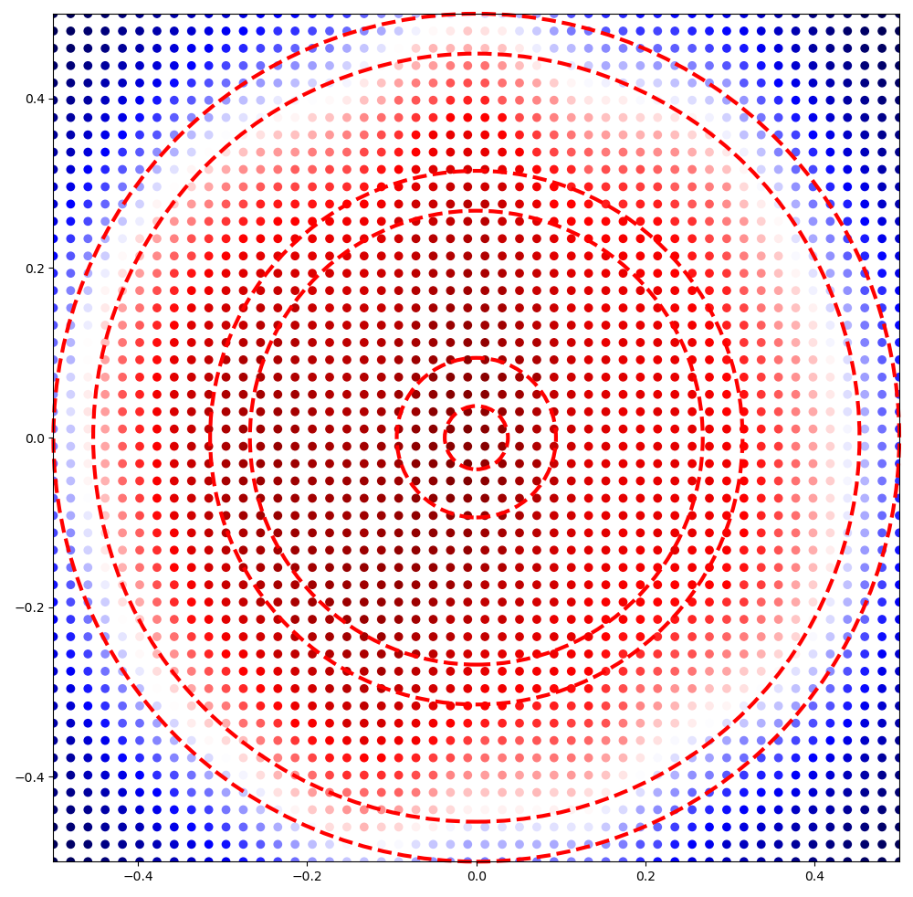
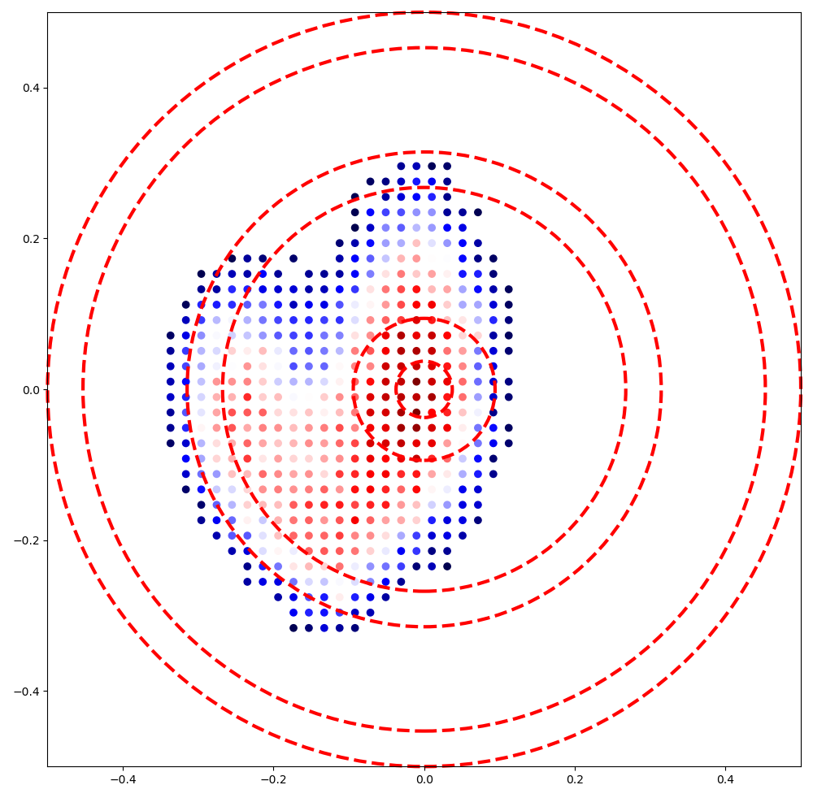
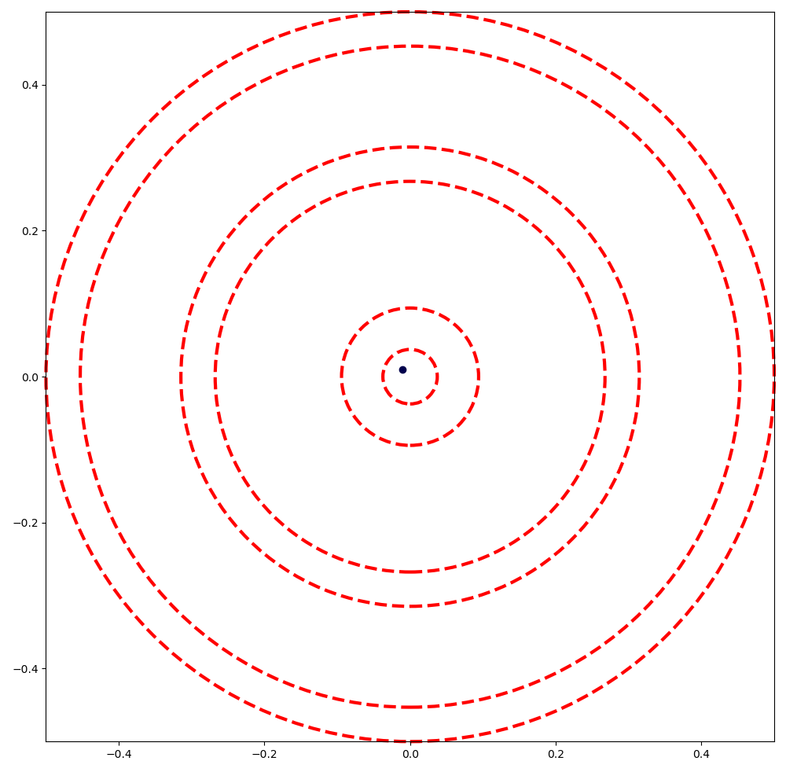

With sigma_x=0.15 and sigma_y=0.09, a player that aims at the middle would get something like:

Knowing this, where should the player aim at to maximize the score per throw?

The answer is: aim at the middle, unless you're exceptionnally good, then aim at the triple 20.