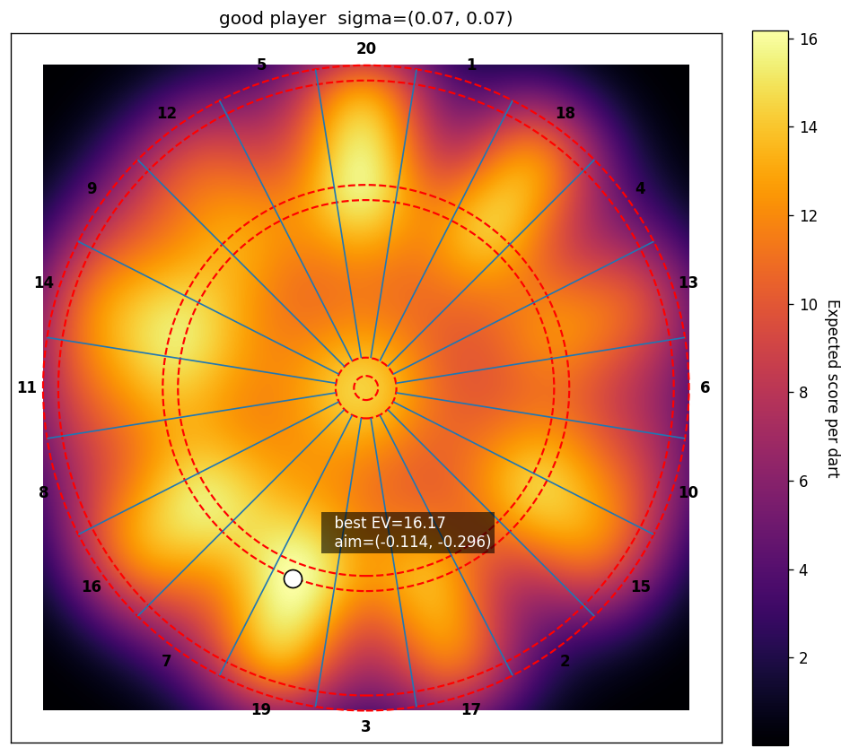

# Dart game optimisation

Solver for the optimal dart aim point given a player's accuracy. Find where to aim to maximise the expected score per dart, and (with the official rules) the optimal aim for every state of the 501 end game.

Both questions reduce to **convolving the dartboard score field with a 2D Gaussian** modelling the player's aim error. The new implementation does this exactly via FFT, replacing the original Monte Carlo brute force.

The math, the design choices, and the rewrite plan are in [`ANALYSIS.md`](ANALYSIS.md).

## What's in here

```
src/darts/         the new solver (Python package, pip-installable)
├─ board.py        dartboard geometry + score function (vectorised)
├─ ev.py           FFT-based expected-value map
├─ outcomes.py     enumeration of the 63 single-dart outcomes
├─ proba.py        per-outcome probability cube (also via FFT)
├─ endgame.py      end-game DP (simple 301 mode + official 501 rules)
├─ covariance.py   2D Gaussian fit for estimating a player's σ
├─ viz.py          heatmap renderer
└─ io.py           .npy + .json output format
scripts/           runnable entry points
data/              solver outputs (per σ): .npy + .json sidecars
results/           plots: heatmaps, V(s) curves, optimum trail
tests/             34 tests including FFT-vs-Monte-Carlo verification
reference_python/  the original 2022 code, frozen as the verification oracle
ANALYSIS.md        review of the original code + rewrite plan
```

## Install

```bash
python -m venv .venv
source .venv/bin/activate
pip install -e ".[dev]"
pytest                                     # 34 tests, ~6 seconds
```

## Reproduce all results

```bash
python scripts/generate_results.py         # data/ — about 2 minutes
python scripts/generate_heatmaps.py        # results/heatmaps/
python scripts/plot_endgame.py             # results/endgame/
```

## Estimate your own σ

Manual interactive tool that loads a dartboard photo, lets you calibrate scale (click centre + outer-bull ring) and click each hit, then fits a 2D Gaussian:

```bash
python scripts/click_hits.py path/to/your/photo.jpg
```

(Eventually this lives on a website — for now the desktop tool is the v1.)

## Results: best aim by player skill (FFT solver)

| Player level | σ_x | σ_y | best aim (board) | expected score / dart |
|---|---|---|---|---|
| excellent | 0.02 | 0.02 | (+0.303, +0.001) — triple-20 | 37.18 |
| good      | 0.07 | 0.07 | (-0.296, +0.114) — triple-19 / inner-7 area | 16.17 |
| average   | 0.15 | 0.09 | (-0.042, +0.255) — between bull and triple-11 | 13.52 |
| bad       | 0.20 | 0.20 | (-0.029, +0.076) — near bull | 12.04 |

The optimum migrates smoothly from triple-20 → triple-19 → bull as σ grows; see [`results/endgame/optimum_trail.png`](results/endgame/optimum_trail.png).

For the canonical good player, full 501 with double-out + 3-dart turns: expected throws to finish = **40.5** (≈ 13.5 turns).

## State of the art

Cross-checks against the reference code (Monte-Carlo solver from 2022), and consistent with:

- Tibshirani, Price & Taylor, [*A Statistician Plays Darts*](https://www.stat.cmu.edu/~ryantibs/papers/darts.pdf) — same single-dart EV findings.
- Haugh & Wang, [*Play Like the Pros? Solving the Game of Darts as a DP*](https://arxiv.org/pdf/2011.11031) — extends to the adversarial multi-turn game.
- [DataGenetics, *Throwing Darts*](https://www.datagenetics.com/blog/january12012/index.html) and the [CodeProject Monte-Carlo article](https://www.codeproject.com/Articles/461044/Throwing-Darts-in-Monte-Carlo) for visual comparisons.

The original work used Monte Carlo over a 51×51 aim grid; the new solver computes the same quantities exactly on a 1024×1024 grid via Gaussian convolution. Verification: the new `darts.board.get_score` matches the reference's pixel-by-pixel on a 200×200 grid (`tests/test_board.py`); the FFT EV agrees with 1M-sample Monte Carlo for six (aim, σ) configurations (`tests/test_fft_vs_mc.py`); the end-game DP agrees with the reference's pickled 301-game V values within Monte Carlo noise (`tests/test_endgame.py`).
