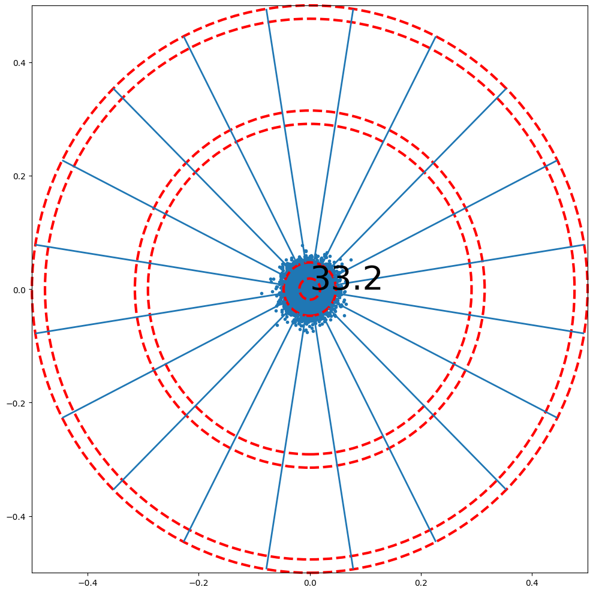
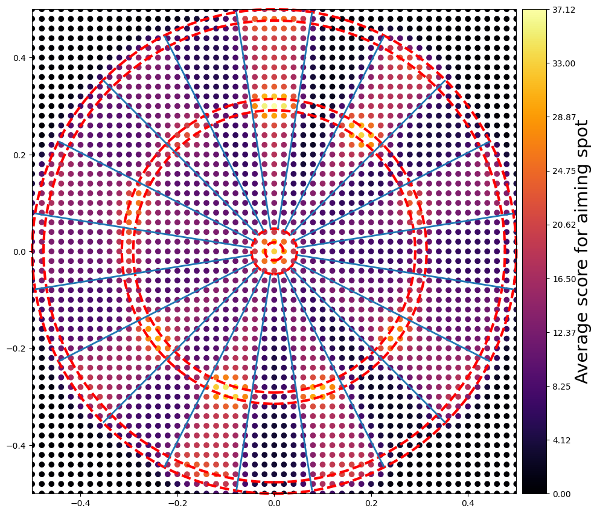
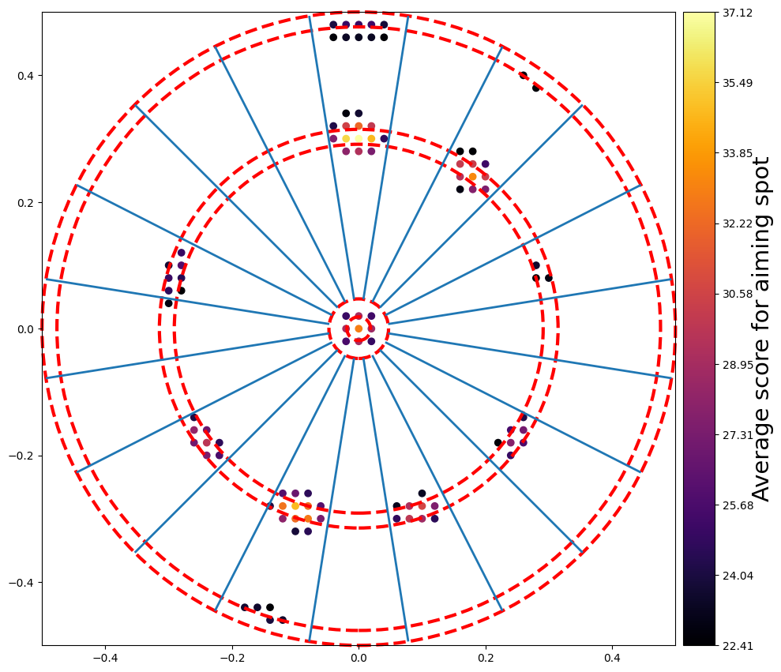
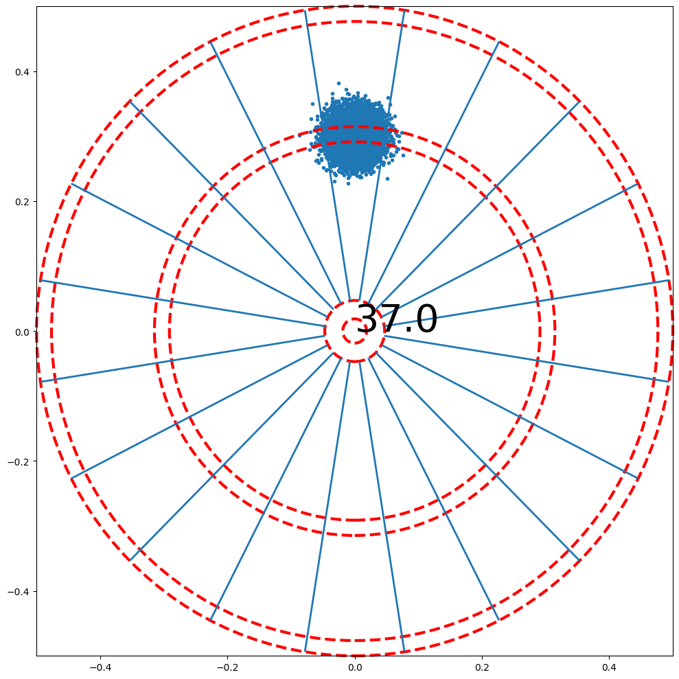
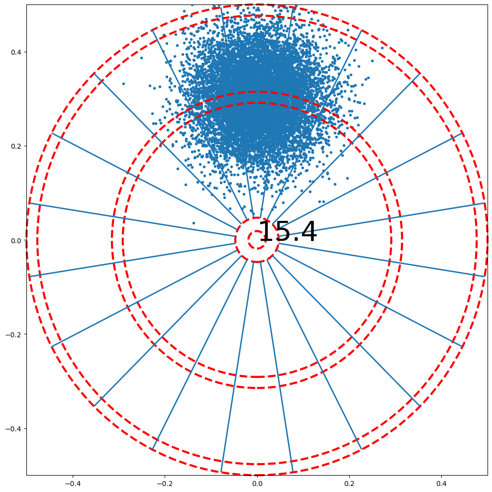
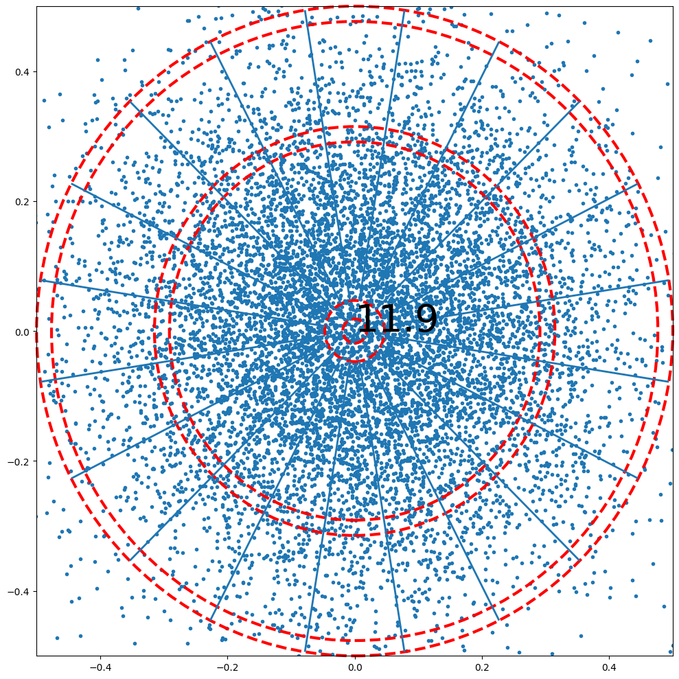
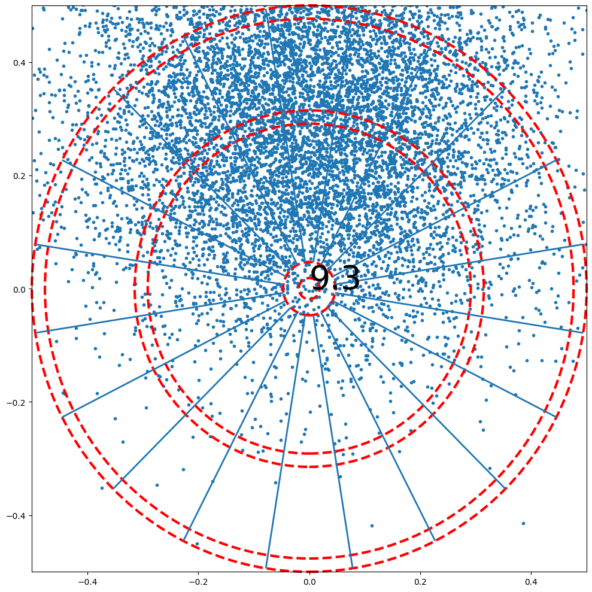

# Description
A simple Python program to solve the game of darts. More precisely, if the accuracy (2x2 covariance matrix) of a player is known, then the optimal aiming position can be calculated. This is achieved through a brute force method.

Should you aim for triple 20? For the bull's eye? Something else? The answer actually depends on your skill level.

# Results
TL&DR: 
- Unless you're an excellent player, aiming at the triple 20 is a trap.
- If you're bad, aim for the center and pray
- If you're in between, the optimal aiming spot changes depending on your skill level. You can use this library to output a tailored aim map.

Optimal aiming spots for (from left to right) a bad player, an average player, a good player and an excellent player

Below several simulations for several types of players.

## Excellent player with sigma_x=0.02 and sigma_y=0.02

With sigma_x=0.02 and sigma_y=0.02, a player that aims at the middle would get something like this after throwing 2601 darts:

Knowing this, where should the player aim at to maximize the score per throw?

The best aiming spot is at (0.3, 0.0):

How much better is the optimal aiming spot compared to other common aiming spots?
Ideal shot 37.5 points per shot:

Center shot 32.8 points per shot:

## Good player with sigma_x=0.07 and sigma_y=0.07

With sigma_x=0.07 and sigma_y=0.07, a player that aims at the middle would get something like this after throwing 2601 darts:

Knowing this, where should the player aim at to maximize the score per throw?

The best aiming spot is at (-0.3, 0.12):

How much better is the optimal aiming spot compared to other common aiming spots?
Ideal shot 16.4 points per shot:

Center shot 14.7 points per shot:

triple 20 shot 14.8 points per shot:

## Average player with sigma_x=0.15 and sigma_y=0.09

With sigma_x=0.15 and sigma_y=0.09, a player that aims at the middle would get something like this after throwing 2601 darts:

Knowing this, where should the player aim at to maximize the score per throw?
Below, 2601 aiming positions were tried, for each position 10 000 darts were "thrown" in simulation. The expected value for each of the 2061 aiming positions is then calculated and showcased below:

The best aiming spot is at (-0.06, 0.24):

How much better is the optimal aiming spot compared to other common aiming spots?
Ideal shot 13.5 points per shot:

Center shot 12.5 points per shot:

triple 20 shot 11.9 points per shot:

## Bad player with sigma_x=0.2 and sigma_y=0.2

With sigma_x=0.2 and sigma_y=0.2, a player that aims at the middle would get something like this after throwing 2601 darts:

Knowing this, where should the player aim at to maximize the score per throw?

The best aiming spot is at (-0.020, 0.0999999):

How much better is the optimal aiming spot compared to other common aiming spots?
Ideal shot 12.0 points per shot:

Center shot 11.9 points per shot:

triple 20 shot 9.8 points per shot:

# References and articles on this topic
https://pages.cs.wisc.edu/~bolo/darts/x01.html

https://commons.wikimedia.org/wiki/File:Optimal_Dart_Throw_Location_Skill_Level.svg

https://www.stat.cmu.edu/~ryantibs/darts/

https://www.stat.cmu.edu/~ryantibs/papers/darts.pdf

