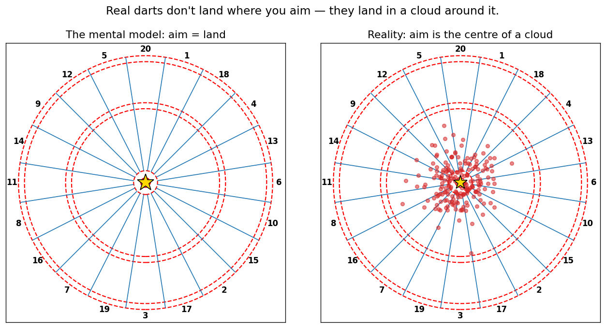
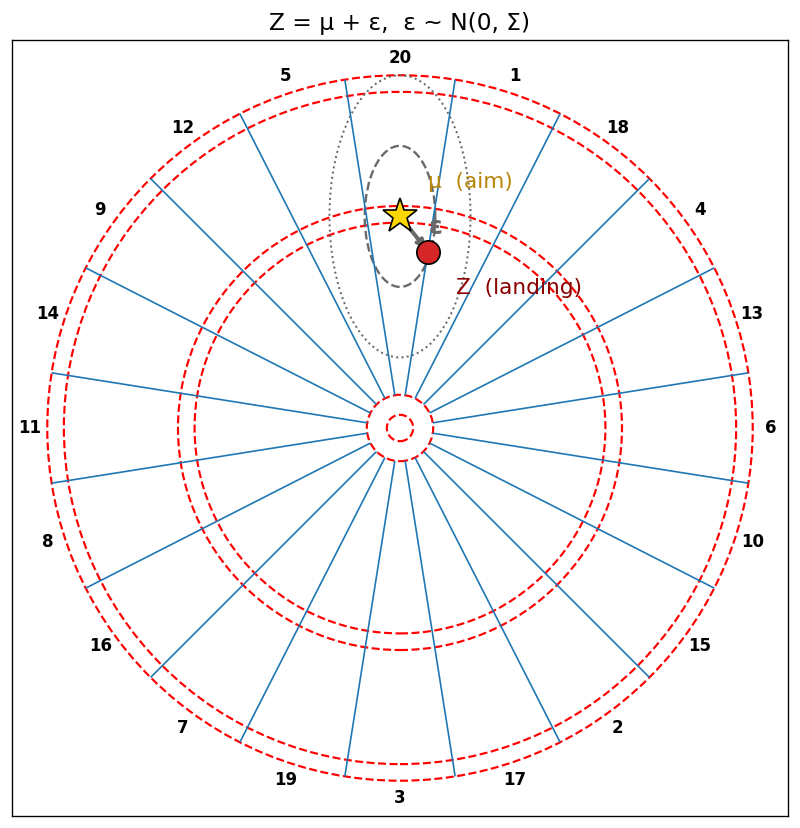
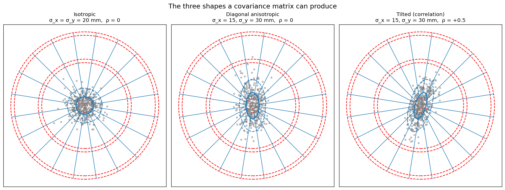
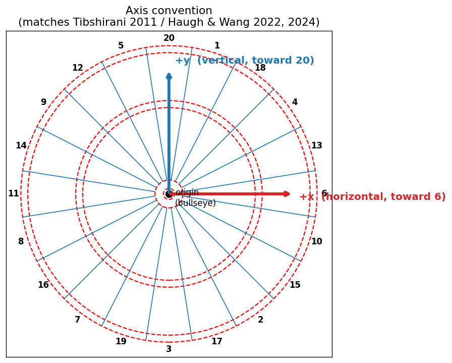
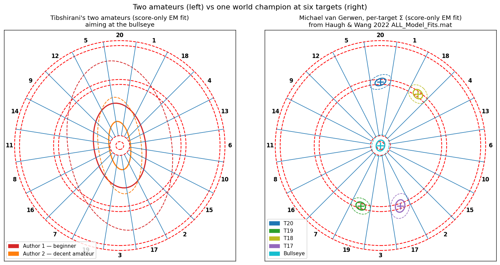
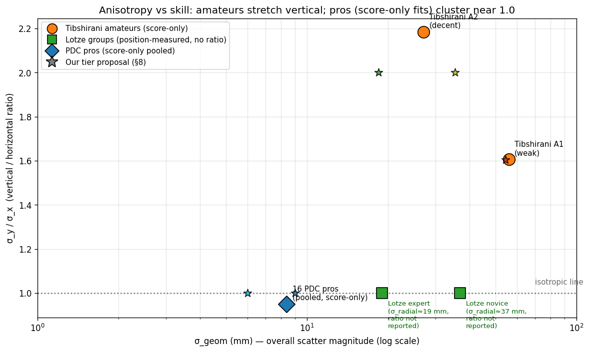
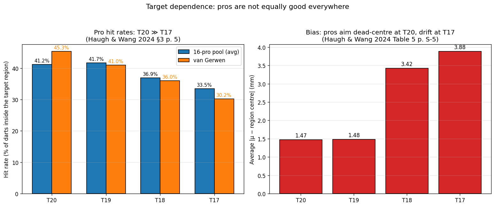
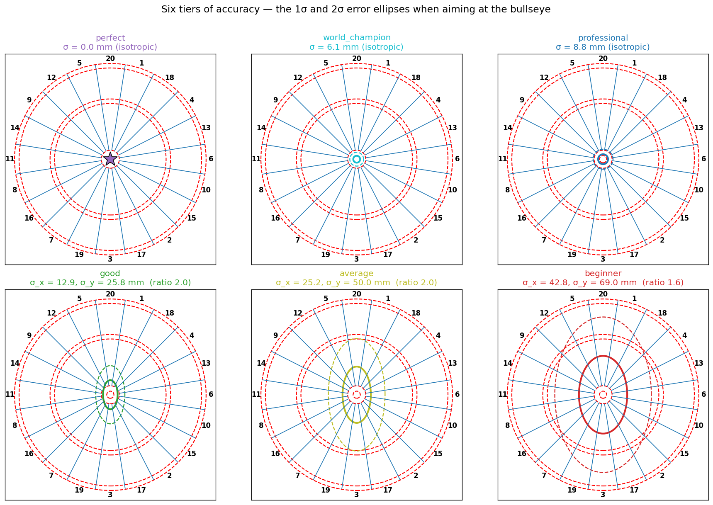
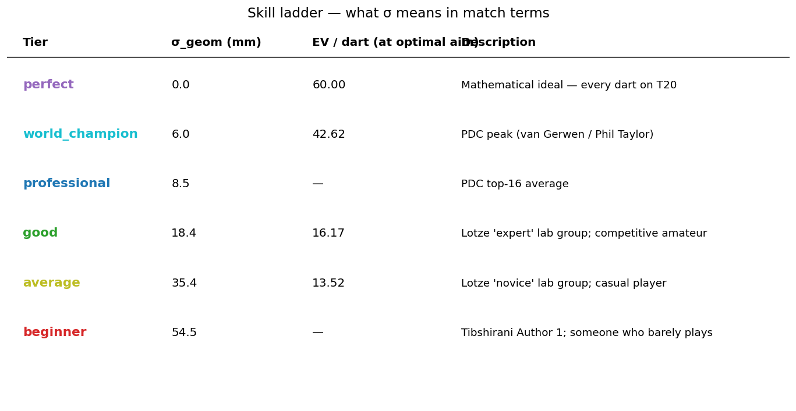
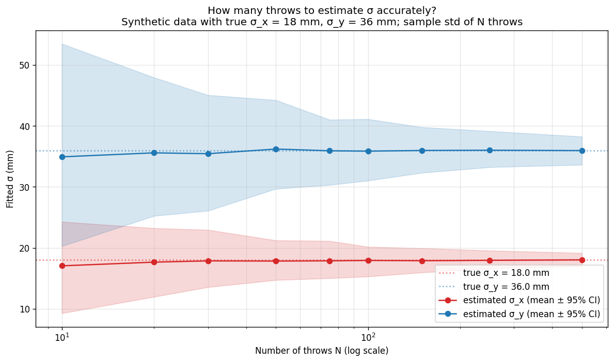

# How to model a player's accuracy

> Section §3 of the blog. Detailed treatment of the player-accuracy model, vocabulary, the data behind every numerical choice, and the limits of the model. Read top-to-bottom this is ~4500 words. The early subsections are written so a non-technical reader can follow; the later ones go progressively deeper, and each numerical claim is grounded in a paper that lives in [`papers/`](../papers/). Where we make a choice that's *not* dictated by data, we say so.

## 1. The question, and the simplest possible answer

A dart leaves the player's hand aimed at some point on the board, and lands at some other point nearby. The *aim* point is a deliberate choice; the *landing* point is partly random. To compute where the player should aim, we need a model for that randomness.

We can ask the model two things:

1. **For a given aim, what's the distribution of landing points?** — single-throw question.
2. **How does that distribution depend on who's throwing?** — player-skill question.

The single sharpest answer in the literature is to model the landing point as a **two-dimensional Gaussian distribution centred on the aim**. The Gaussian is fully described by two numbers: where its centre is (we'll set that equal to the aim point) and how "spread out" it is. The spread is captured by a small matrix called the **covariance matrix**, written Σ (capital Greek sigma). This is the model every paper on darts optimization since Tibshirani, Price & Taylor uses [^tibshirani2011], and it's what we use here.

The rest of this section unpacks (a) what those two words — "two-dimensional Gaussian" and "covariance matrix" — actually mean and look like, (b) what numerical values are realistic for each skill level, (c) when the model fails.

*Figure 3.1 — The mental model (left) versus reality (right). Same aim, 200 simulated throws drawn from a 2D Gaussian with σ = 25 mm.*

## 2. Vocabulary you can refer back to

Read this once, refer back as needed.

- **σ** is the lowercase Greek letter *sigma* (pronounced "**SIG**-mah"). In statistics it conventionally denotes a **standard deviation** — informally, the typical size of an error. So "σ = 25 mm" means "the typical miss is about 25 mm". σ is always non-negative.
- **σ²** is the variance — sigma squared. Same information as σ, just on the squared scale; you'll see it in formulas because the math is cleaner there.
- **Σ** is the uppercase Greek letter *Sigma* (same name, same pronunciation, capital). In statistics it conventionally denotes a **covariance matrix**, which is the multi-dimensional version of σ². For our 2D darts problem Σ is a 2×2 matrix.
- **Gaussian** (= normal distribution) is the bell-curve probability distribution. In 2D, it's a bell-shaped *surface* (a hill of probability) hovering over the plane.
- **2D Gaussian = bivariate normal**: same thing, two names. We'll use "2D Gaussian".
- **Aim point** (or *intended target*): where the player meant to throw. We write it μ (mu) in formulas — μ is the **mean** of the Gaussian.
- **Landing point**: where the dart actually ended up. We write it Z.

The model is then literally one line:

    Z = μ + ε,        ε ~ N(0, Σ)

In words: the landing point Z equals the aim point μ plus an error ε, where the error follows a Gaussian distribution centred at the origin with covariance Σ.

*Figure 3.2 — The model in one picture. The aim point μ (gold star), the actual landing Z (red dot), and the random error ε that connects them. The dashed ellipses are the 1σ and 2σ contours of the error distribution.*

## 3. What the covariance matrix Σ looks like and what each entry means

Σ is a 2×2 matrix:

         ⎡ Σ_xx  Σ_xy ⎤
    Σ =  ⎢            ⎥
         ⎣ Σ_yx  Σ_yy ⎦

There are three independent numbers in here (Σ_xy = Σ_yx because the matrix is required to be *symmetric* — see the box below):

- **Σ_xx = σ_x²** — the variance along the x-axis (how scattered horizontally, ignoring vertical).
- **Σ_yy = σ_y²** — the variance along the y-axis (how scattered vertically, ignoring horizontal).
- **Σ_xy = ρ · σ_x · σ_y** — the off-diagonal term. ρ (rho) is the **correlation coefficient** between the x and y errors, a number between −1 and +1. ρ = 0 means horizontal and vertical errors are independent; ρ ≠ 0 means they're linked (e.g. when you miss right, you also tend to miss high).

Geometrically, the iso-probability contours of a 2D Gaussian are **ellipses**, and Σ tells you the shape, size, and orientation of those ellipses:

- A circular cloud → σ_x = σ_y, ρ = 0.
- A vertically-stretched ellipse → σ_y > σ_x, ρ = 0.
- A tilted ellipse → ρ ≠ 0.

*Figure 3.3 — The three shapes a covariance matrix can produce. Isotropic (left): a single number σ describes a circular cloud. Diagonal anisotropic (centre): two independent numbers σ_x and σ_y describe an axis-aligned ellipse. Full Σ with ρ ≠ 0 (right): three numbers describe a tilted ellipse. The single most important figure of the section.*

> **Sidebar: "symmetric", "diagonal", "isotropic" — which is which?**
>
> These three adjectives describe Σ at different levels of generality.
>
> - A **symmetric** matrix means Σ_xy = Σ_yx. *Every* covariance matrix is symmetric, automatically — it's a property of the math, not a modelling choice. We won't say "symmetric Σ" again because there is no other kind.
> - A **diagonal** matrix means the off-diagonal entries are zero (ρ = 0): horizontal and vertical errors are independent. The ellipses are axis-aligned. "Diagonal" implies axis-aligned but says nothing about whether σ_x = σ_y.
> - An **isotropic** (a.k.a. **spherical**) covariance means it's *both* diagonal *and* σ_x = σ_y. The ellipses are circles, and the model has only one number, σ.
>
> So in order of increasing freedom: isotropic ⊂ diagonal ⊂ full (= symmetric, the most general). All the published dart papers consider at least the full version; some restrict to one of the simpler forms for clarity.

## 4. The axis convention, once and for all

This is the kind of thing that silently causes everyone's heatmaps to be 90° wrong, so we state it up front. We adopt the same convention as every paper cited in this post (Tibshirani 2011 §3 p. 7; Haugh & Wang 2022 §3 p. 5; Haugh & Wang 2024 §7) and as standard math/computer-vision practice:

> **Our convention** (this project; defined in `src/darts/board.py`):
>
> - **x** is the **horizontal** axis. **+x points to the right** (toward the 6 wedge, at the 3 o'clock position).
> - **y** is the **vertical** axis. **+y points upward** (toward the 20 wedge, at the top of the board).
> - The origin is the centre of the bullseye.
> - Both axes are normalised to [-0.5, 0.5], so the full board fits exactly in the unit square.

The biomechanical claim that "vertical scatter is larger than horizontal" reads as σ_y > σ_x in both the papers and in our code. Every numerical σ value we quote from the literature in this post is **stated directly in this convention**, with no rotation footnote needed.

*Figure 3.4 — Our axis convention, matching Tibshirani 2011 and Haugh & Wang. +x is horizontal (right, toward the 6); +y is vertical (up, toward the 20); origin at the bullseye.*

## 5. What the data says: empirical fits from the literature

There are two qualitatively different kinds of data on player accuracy in the published record. **Score-only inferences** — where the only observed quantity per throw is the region the dart landed in, and Σ is recovered by EM — give us most of the numbers, including all of the canonical pro fits. **Position measurements** — where the actual (x, y) landing point is recorded — exist in a small number of biomechanics studies but produce much less detailed Σ statistics, and *do not exist at all for the PDC pros* (more on this in §5.3).

We start with the score-only data because that's where the headline numbers live, then turn to what little position-measured evidence is available.

### 5.1 Amateurs: Tibshirani's two authors

Tibshirani et al. asked two of the paper's authors to each throw 100 darts aimed at the bullseye and recorded only the *scores* (which region each dart landed in, not the precise position). Using an EM algorithm (§3.1 p. 7 of [Tibshirani 2011, in `papers/tibshirani_2011_darts.pdf`][^tibshirani2011]) they fit both a simple isotropic σ and the general 2×2 Σ. Here are the resulting fits, in the paper's (= our) convention:

| Player          | Simple isotropic σ | Full Σ fit                              | Ratio σ_y / σ_x |
|-----------------|--------------------|------------------------------------------|------------------|
| "Author 1" (weak amateur, Tibshirani himself) | 64.6 mm | σ_x = 42.7, σ_y = 68.6, ρ = −0.16 | **1.61** |
| "Author 2" (decent amateur, Andy Price)        | 26.9 mm | σ_x = 17.9, σ_y = 39.1, ρ = −0.22 | **2.19** |

Two important takeaways from this single table:

1. **Even the "weak" beginner has anisotropic error.** Both amateurs land with significantly more vertical (σ_y) scatter than horizontal (σ_x) — a ratio of roughly 1.6 to 2.2. The σ = 64.6 vs σ = 26.9 numbers that the simple isotropic fit returns are just *summaries* of the true asymmetric distributions; they hide the asymmetry but it's there. We have to be careful about citing "the beginner has σ = 65 mm" without noting that the actual error ellipse is taller-than-wide.
2. **Tibshirani §3 attributes the asymmetry to biomechanics**: "[i]t is common for most players to have a smaller variance in the horizontal direction than in the vertical one, since the throwing motion is up-and-down with no … lateral component" (p. 7). This isn't a per-player accident, it's a structural feature of how people throw.

These are the only two amateur-σ data points in the published literature. They anchor our "beginner" and "good amateur" tiers respectively.

### 5.2 Professionals: the 16 PDC top-16 from Haugh & Wang

The professional skill model comes from the data accompanying [Haugh & Wang 2022][^hw2022]. They have the 2019 PDC season's full per-player, per-target hit counts for the top 16 players, and they fit a *separate* Σ for each of six target regions (T20, T19, T18, T17, the inner bullseye, and a lump of all twenty doubles). The numerical fits are in `papers/OptimalDarts_repo/ALL_Model_Fits.mat`. Aggregated over the 16 pros and pooled across all six target regions, the typical σ is **σ_x ≈ 8.6 mm, σ_y ≈ 8.2 mm — almost isotropic**.

A few individual players, just to make it concrete (T20 region):

| Player                | σ_x (mm) | σ_y (mm) | ρ      |
|-----------------------|----------|----------|--------|
| Michael van Gerwen    | 8.78     | 6.06     | +0.36  |
| Gerwyn Price          | 9.67     | 6.16     | +0.29  |
| Peter Wright          | 9.70     | 6.60     | +0.30  |
| Mensur Suljovic       | 8.95     | 7.07     | +0.46  |

Three things stand out:

1. **All four have σ_x > σ_y at T20** — *horizontal* scatter is larger than vertical at this specific target. This is the **opposite** of the amateur biomechanical pattern (where σ_y > σ_x). We address this puzzle in §6.
2. **σ at T20 is in the 6–10 mm range** for top-of-the-table pros, consistent with the rule-of-thumb "5 mm" Tibshirani uses to illustrate a near-perfect thrower.
3. **The correlation ρ is non-zero and consistent in sign** (~+0.3 to +0.5 for these four). We'd love to attach a physical meaning to this but we can't — see §6 again.

*Figure 3.5 — Two amateurs (left) vs one world champion at six different targets (right). The amateurs' ellipses are large and visibly elongated vertically; the pro's are tight and have different orientations at different target regions — see §6 for why we treat that orientation variation skeptically.*

### 5.3 Position-measured data: a fundamental gap in the public record

The single most striking thing we found while writing this section is **what doesn't exist**. As far as we can determine, there is no publicly available dataset of measured (x, y) dart landing positions paired with a fitted individual covariance matrix — anywhere. Not for any PDC professional, not for any named amateur, not in any academic paper, not in any commercial CV product, not in any hobbyist project on GitHub.

This matters because, as we'll see in §6, the off-diagonal element of Σ literally cannot be recovered from score data alone. The papers that fit pro Σ from PDC broadcast scores explicitly say so. **The numbers in §5.2 are not measurements of how van Gerwen's darts actually scatter; they are the best-fitting bivariate-normal model under the constraint that you only observe the score, not the landing point.** The distinction will become important.

What *does* exist, with quantitative caveats:

| Source | Method | What is measured | Anchor σ |
|---|---|---|---|
| [Lotze et al. 2019][^lotze2019] (PLOS ONE) | 5 mm position grid; 20 experts + 21 novices; ~60 throws each | bivariate variable error (BVE), group means | expert ≈ 3.8 cm BVE ⇒ σ_radial ≈ **19 mm**; novice ≈ 7.4 cm BVE ⇒ σ_radial ≈ **37 mm** |
| [Churron et al. 2014][^churron2014] (PMC) | 200 Hz 6-camera motion capture; 8 experts + 8 novices, 60 throws each | mean vertical error (horizontal dropped as "negligible") | best expert vertical error ≈ **13.5 mm** |
| [Morice et al. 2013][^morice2013] (PLOS ONE) | Optotrak 0.1 mm tracking; 8 experts + 9 beginners, 180 throws each | autocorrelation analysis; CE contours | qualitative: expert variance ≪ beginner variance, p = 3 × 10⁻⁶ |
| [DeepDarts (McNally et al. 2021)][^deepdarts] (CVPR-W) | computer vision on dartboard images | per-dart (x, y) labels in ~16 k images | not a player-scatter dataset — it's a CV training benchmark, no per-player Σ |

A few commercial computer-vision systems do exist (Scolia, Autodarts, Gungnir) and *do* measure landing positions to roughly millimetre accuracy, but their data is held privately inside user accounts; none of them publish per-player σ.

Three things worth flagging from the table:

1. **Lotze et al.'s "expert"** group (BVE 3.8 cm ≈ σ_radial 19 mm) is the tightest position-measured σ in the published record. We use it as our best non-pro anchor in the tier scheme below.
2. **Churron et al.'s methodological choice** is itself evidence for anisotropy: they explicitly dropped horizontal-error analysis because for trained players it's so much smaller than vertical error that 1-D vertical-only analysis loses nothing. This is independent confirmation of Tibshirani's biomechanical argument (§5.1).
3. **For the actual numerical Σ matrices of PDC top-tier pros, the literature gives us nothing position-measured**. Every quoted pro number anywhere — including the Haugh & Wang Σ matrices in §5.2 — comes from score-only EM. This is the model's biggest known limitation, and §6 walks through what it implies.

## 6. The anisotropy puzzle: does the ratio depend on skill?

Sharp version of the question we landed on while drafting this: **Tibshirani's amateurs have σ_y / σ_x ≈ 1.6 to 2.2 (vertical scatter much larger than horizontal), but the pros' pooled-across-regions average is essentially isotropic (≈ 0.96). Is anisotropy a beginner thing that disappears with skill, or is something else going on?**

The honest answer is "we can't fully tell from the published data, but here's what we can say."

### What we know
- The amateur asymmetry is large, has the same sign for both Tibshirani authors, and is attributed to the throwing motion. It's almost certainly real (Tibshirani 2011 §3 p. 7).
- The pro pooled ratio of ~1.0 is computed from the six per-region Σ matrices, *averaged* across regions. This is the right number to compare to the amateurs' bullseye-only fit only if you assume Σ is global — which the pros' data say it isn't (§7).
- Within a single region, individual pros are *not* isotropic. At T20, four of the four pros above have σ_x noticeably larger than σ_y; at T18 the relationship flips for many of them. The per-region ellipse orientation seems to track the target region's geometry — wide bed → flatter ellipse, tall bed → taller ellipse.

### What the literature has to say about this
[Haugh & Wang 2024 §7.1, in `papers/haugh_wang_2024_eb_darts.pdf`][^hw2024], dedicates a section to exactly this problem. Their conclusion (p. 18, paraphrased): when you only have *scores* (no actual (x, y) landing positions), the off-diagonal entry of the fitted Σ is **not identifiable**. They show a synthetic example (Figure 5, p. 19) of three landing-point datasets with very different true correlations ρ ∈ {−0.5, 0, +0.5} that produce *identical* observed score frequencies — and therefore identical EM fits up to that nuisance parameter.

Worse, their analysis suggests **the fitted ellipse orientation tends to align with the geometric extent of the target region**, not with the player's true error direction. For T20 (a "tall" region — narrow horizontally, deep radially), score-only data plus EM gives you back an ellipse stretched in roughly the radial direction. This is the model's least bad fit to the available information, not a measurement of the player's body.

The implication is sobering: **the pro per-region anisotropy reported in OptimalDarts and analysed in Haugh & Wang 2022 should not be interpreted as "this pro is more accurate horizontally than vertically when throwing at T20."** It is a statistical fit to score data, with known identifiability issues; you cannot read the eigenvectors of the fitted Σ as biomechanical statements.

For amateurs the same caveat technically applies, but the asymmetry is so large and so consistent across the two known datapoints — and **independently confirmed by Churron et al.'s position-measured data** (§5.3, where horizontal error is so small it can be dropped from analysis) — and the biomechanical explanation is so plausible — that we are comfortable treating "σ_y > σ_x" (vertical scatter > horizontal) as a real signal for amateur-level players.

### Our modelling choice (and we flag this as a choice, not a deduction)

We apply an anisotropy ratio at the **amateur** tiers (beginner, average, good) anchored on Tibshirani's two empirical fits, and we make the **pro/world-champion** tiers isotropic. The rationale:

- For amateurs: the asymmetry is empirically supported and biomechanically grounded. Ignoring it would be a worse model than including it.
- For pros: the asymmetric per-region fits exist but cannot be interpreted as physical anisotropy of the player. The simplest defensible choice is to use a single isotropic σ that summarises the player's overall T20-region accuracy. A genuinely physical pro model would require landing-position data, which doesn't exist in the published record.

A reader interested in the per-region Haugh & Wang model can use the matrices in `papers/OptimalDarts_repo/ALL_Model_Fits.mat` directly — our infrastructure supports diagonal Σ, and a small wrapper would let it consume the full 96-matrix table for the 16 PDC pros. We discuss this in §9 as a future extension.

*Figure 3.6 — How the anisotropy ratio (σ_y / σ_x) varies with skill. Amateurs (orange) cluster well above 1 — vertical scatter dominates. Pros (blue) cluster at ~1.0, but as §6 argues, that flatness is an artefact of fitting score-only data, not a measurement of physical isotropy. Lotze's position-measured groups (green) report no anisotropy ratio; we plot them at the isotropic line to flag what was not measured.*

## 7. Target dependence: how σ varies across the board

This is the model's biggest known limitation and the user asked us to discuss it explicitly. Both Haugh & Wang papers fit *separate* Σ for each target region, and the data shows this matters — for pros.

### The data, in one paragraph

For the 16 PDC top-16 pros pooled (Haugh & Wang 2024 §3 p. 5):

- T20 hit rate: 41.2%
- T19 hit rate: 41.7%
- T18 hit rate: 36.9%
- T17 hit rate: 33.5%

Why the spread? T20 is the practice target. The 8-percentage-point gap from T20 to T17 corresponds to roughly 20-30% larger σ at T17 than at T20 for typical pros, with significant per-player variation. For the example of Michael van Gerwen: T20 hit-rate is 45.3%, T17 is 30.2% (Haugh & Wang 2024 §5 p. 10). For Lewis A. the geometric-mean σ at T17 is ≈ 11.1 mm versus ≈ 8.4 mm at T20 — about 32% larger.

There's a second flavour of target-dependence: **bias** — the player's *actual* aim point can be offset from the *intended* target. From [Haugh & Wang 2024 Table 5 p. S-5, in `papers/haugh_wang_2024_eb_darts.pdf`][^hw2024], averaged across 16 pros, the distance between fitted μ and the region centre is:

- T20: 1.47 mm
- T19: 1.48 mm
- T18: 3.42 mm
- T17: 3.88 mm

Pros aim almost dead-centre at their practice target T20, and noticeably *off*-centre at the less-rehearsed T17. The bivariate normal absorbs this offset into the (μ, Σ) joint fit, which is why the *apparent* σ inflates at less-practised targets even more than the pure error inflates.

For amateurs there is **no published data** on target dependence. Tibshirani 2011 fits one Σ per player, period. Two opposing intuitions:

- Amateurs almost always throw at T20 anyway (it's the high-score target), so they get less differential practice and might have *less* per-region heterogeneity than pros.
- But amateurs' σ is so much larger (25–70 mm vs 5–10 mm) that small per-region differences are dominated by the overall scatter; even a 30% per-region inflation is hard to detect from 100 throws.

### How serious is the limitation?

For **pros**, ignoring target dependence is costly. Haugh & Wang 2024 Table 3 (p. 23) shows that a pro who plays *as if* their Σ were global, when it actually varies by region, loses ~5.4% of match win-probability over a 35-leg match (12% for Jonny Clayton specifically). They write (§5 p. 10): "[assuming global Σ] would result in a drastic underestimation of a player's skill level and should be avoided" — for pros.

For **amateurs** the cost is presumably much smaller; nobody has measured it, but the model error is in the noise of the much larger global σ.

### Why we don't model it (and how a determined reader could)

Building a target-dependent solver would require either:

(a) A continuous function σ(x, y) that the solver can evaluate at any aim point — but we have no principled way to interpolate between Haugh & Wang's six discrete fitted regions (R^2 → R^4 is overkill from six samples), and
(b) A per-region Σ table queried at solve time — but this multiplies the bookkeeping and only helps the high-skill end of the spectrum.

We chose (deliberate choice, not deduction): treat σ as global. The data presented above is the **upper bound on the magnitude of the error** this choice introduces. For amateurs, treating σ as global is probably fine; for pros, it costs a few percent of match win-probability against the per-region truth.

A motivated individual player who wants to refine the model has a clear path: throw 50–100 darts at each of their main targets (T20, T19, T18, T17, bullseye, D-out targets), fit a separate Σ per region (the `darts.covariance` module already supports this — you just need to bucket your throws by aim), and feed the result into a small per-region wrapper around our solver. We sketch this extension in §11.

*Figure 3.7 — Pros are not equally good at every triple. Left: T20/T19/T18/T17 hit rates for the 16-pro pool and for van Gerwen specifically. Right: the average distance between the fitted aim point μ and the region centre — i.e. how far the player's actual aim drifts from the intended target. Both panels show a clean monotonic degradation away from T20, the practice target.*

## 8. The six-tier proposal (anchored, not arbitrary)

Putting all of the above together, here is our proposed six-tier scheme. We give for each tier the **σ_x (horizontal) and σ_y (vertical) in normalised board units** so the values plug straight into our solver, plus the literature anchor that motivates the choice.

| Tier              | σ_x (mm) | σ_y (mm) | σ_x norm | σ_y norm | Ratio σ_y/σ_x | Anchored on                                                                  |
|-------------------|----------|----------|----------|----------|----------------|-------------------------------------------------------------------------------|
| **perfect**       | 0        | 0        | 0        | 0        | n/a            | mathematical limit; Tibshirani 2011 Figure 2 (σ=5 mm) is the closest empirical reference |
| **world_champion**| 6        | 6        | 0.018    | 0.018    | 1.0 (isotropic; data limitation) | Best PDC pros at T20 (e.g. van Gerwen, Price at ≈ 6 mm at T20)               |
| **professional**  | 9        | 9        | 0.026    | 0.026    | 1.0 (isotropic; data limitation) | Pooled mean of the 16 PDC top-16 across all six target regions (≈ 8.4 mm)     |
| **good**          | 13       | 26       | 0.038    | 0.076    | 2.0            | **Lotze et al. 2019** expert group (BVE 3.8 cm ⇒ σ_radial ≈ 19 mm), position-measured, with the Tibshirani-derived 2:1 anisotropy applied |
| **average**       | 25       | 50       | 0.074    | 0.147    | 2.0            | **Lotze et al. 2019** novice group (BVE 7.4 cm ⇒ σ_radial ≈ 37 mm), position-measured |
| **beginner**      | 43       | 69       | 0.126    | 0.203    | 1.60           | Tibshirani Author 1 (weak amateur) full-Σ fit, score-only                    |

Notes on the choices:

- **`good` and `average` are now anchored on the only position-measured study we found** (Lotze et al. 2019). The Lotze paper reports a single bivariate-variable-error number per group, not a per-player Σ, so we interpret it as the radial σ and split it into σ_x and σ_y using the 2:1 vertical-to-horizontal ratio that Tibshirani's authors and Churron et al.'s motion-capture data both support. **Old values from Tibshirani 2011 (score-only fits at the same skill level) are about 1.5× larger** — likely because Lotze's lab-recruited experts were dart-trained whereas Tibshirani's authors were statisticians who happened to play, but also possibly because score-only inference systematically inflates σ when there's mass near boundaries. Either way the position-measured number is the better anchor for "what a decent recreational player's σ actually is".
- **`beginner` stays at Tibshirani Author 1** (full-Σ score-only fit). Lotze's novice group is at σ ≈ 37 mm, considerably below Tibshirani's 65 mm, so the two scales don't disagree about "worst published amateur" — they're sampling different populations.
- **Anisotropy applied at amateur tiers, not at pro tiers.** Empirically justified for amateurs (Tibshirani §5.1; Churron §5.3 confirms with position data); knowingly conservative for pros (the per-region anisotropy exists in the score-only fits but cannot be cleanly disentangled from region geometry — see §6).
- **The `professional` tier is anchored on the 16-pro score-only pool**, not on any single player. The `world_champion` tier is the upper edge of that distribution and is calibrated to the best players' σ at T20 specifically (because that's their actual aim 90% of the time). **Both are subject to the score-only-inference caveat**: nobody has actually measured a pro's landing positions, so these are our best guesses, not measurements.
- **The good-to-professional jump (σ ≈ 19 mm → 9 mm, factor 2)** is genuinely large. We considered adding a "competitor" tier in between but found no data to anchor it on — *anything* we put there would be a guess. Better to leave the gap visible: it reflects the actual difference between a competitive amateur and a PDC tour pro.
- **`perfect`** has σ = 0 exactly. The previous version of the codebase used σ = 0.0001 as a safety; the FFT kernel handles σ = 0 (it collapses to a delta function), so we can use the exact zero.

*Figure 3.8 — The six tiers visualised as 1σ (solid) and 2σ (dashed) error ellipses, all aiming at the bullseye. The visual ladder of "how good is good": perfect ⊂ world_champion ⊂ professional ⊂ good ⊂ average ⊂ beginner.*

*Figure 3.9 — The skill ladder, anchored on what σ means in match terms. The expected-EV-per-dart column comes from our solver's optimal-aim heatmaps and lets a reader translate the abstract σ values into "what would my match average look like".*

## 9. Limitations, restated as honest claims

The model we use makes five assumptions worth restating in one place:

1. **Errors are Gaussian.** The 2D Gaussian is empirically adequate; Tibshirani 2011 §4.1 tests a skew-normal extension and finds it does not change the heatmaps meaningfully (p. 10). Heavy-tailed extensions (Student-t, etc.) are not in the published literature and would require landing-position data to motivate.
2. **Errors are independent throw-to-throw.** Each dart's landing point is sampled independently from N(μ, Σ). There is some evidence (Ötting et al. 2020, cited by Haugh & Wang 2022 — not in the local papers folder) that the first dart of a turn is less accurate than the second and third, but this within-turn structure is not in our model.
3. **Σ is global across the board.** As discussed in §7, this is materially false for pros and probably fine for amateurs.
4. **The aim μ equals the intended target ϑ.** Haugh & Wang 2024 Appendix C shows pros have small but measurable biases (~1.5 mm at T20 to ~5 mm at T17). For amateurs, both μ and the bias should probably be inflated proportionally to σ. We assume μ = ϑ throughout.
5. **No bounce-outs.** A dart that hits the wire and bounces off the board is assumed to score zero (i.e. it gets binned into the MISS outcome). Real bounce rate is ~0.3% for pros (Haugh & Wang 2022 Assumption 2, p. 12).

Each of these is a place where a future, more careful model could improve on this one. Each of them is also a place where the current model is the one used by the entire prior published literature, so we're at least no worse than the state of the art.

## 10. Practical methodology: how someone would measure their own σ

If a reader wants to fit their own personal Σ — and we think they should — there are two reasonable methods, both well-attested in the literature:

1. **Score-only EM (Tibshirani 2011 §2.2, §3.1).** Throw n ≥ 50 darts aimed at a single target (canonically the bullseye), record only which region each one hits. Fit Σ by EM with importance-sampling E-step. Closed form for the isotropic special case (Tibshirani §A.2 p. 13). This is what the papers do because it's all the data they can get from broadcast PDC matches.
2. **Position fit from clicked landing points (this project, `darts.covariance`).** If you have a photo of the board with your hits still in it, click each one and fit Σ as the sample covariance of the (x, y) values. This is *strictly more informative* than score-only — it sees the full 2D distribution rather than just its multinomial projection onto the 63-cell partition — and it's what we provide. The `scripts/click_hits.py` tool does this interactively.

The trade-off: score-only EM works at distance (e.g. you can score someone else's PDC match), but produces a Σ whose off-diagonal is, as discussed above, not identifiable. Position-fit needs you to actually photograph and click your own board, but produces a Σ whose every entry is meaningful.

*Figure 3.10 — How many throws you need to fit σ accurately. Synthetic data with true σ_x = 18 mm and σ_y = 36 mm (the "good" tier); each point is the mean of 400 independent fits at that N. By N = 100 the 95% CI is roughly ±10% of the truth; by N = 250 it's ±5%. The knee is around N = 50.*

## 11. What we'd change if we had more data

A short list, in priority order, for anyone who wants to extend the model:

1. **Landing-position data for pros.** With (x, y) for each televised dart we could *actually* identify the off-diagonal of Σ and verify or refute the "per-region anisotropy is a fitting artifact" claim from Haugh & Wang 2024 §7. The technology to track this exists (PDC trialled a tracking system in 2023); the data is not yet public.
2. **Per-region Σ via the OptimalDarts table.** A small wrapper around our solver that consumes the 96 (16-player × 6-region) matrices in `ALL_Model_Fits.mat` would let us reproduce the Haugh & Wang 2022 / 2024 pro analyses directly and compare them to the global-Σ approximation we use. This is a near-term, no-new-data extension.
3. **Within-turn dependence.** If dart 1 is genuinely less accurate than dart 3, the end-game DP's per-state aim policy might shift. Modelling this requires per-throw-position data, which is presumably easier to extract from raw broadcasts than landing-positions.
4. **Personal photo-click datasets at non-bullseye targets.** Any individual reader with a phone camera could produce per-region Σ data for themselves in an afternoon, and the model fitting is a 10-line modification of `darts.covariance.fit_gaussian`. We'd love to collect a small open dataset of "amateur σ at six target regions" — there is literally none in the published record.

---

[^tibshirani2011]: Tibshirani, R. J., Price, A. & Taylor, J. (2011). *A Statistician Plays Darts.* Journal of the Royal Statistical Society Series A, 174(1), 213–226. Local copy: `papers/tibshirani_2011_darts.pdf`. URL: https://www.stat.cmu.edu/~ryantibs/papers/darts.pdf
[^hw2022]: Haugh, M. B. & Wang, C. (2022). *Play Like the Pros? Solving the Game of Darts as a Dynamic Zero-Sum Game.* INFORMS Journal on Computing, 34(5), 2540–2551 (arXiv:2011.11031). Local: `papers/haugh_wang_2022_dp_darts.pdf`. URL: https://arxiv.org/abs/2011.11031
[^hw2024]: Haugh, M. B. & Wang, C. (2024). *An Empirical Bayes Approach for Estimating Skill Models for Professional Darts Players.* arXiv:2302.10750v3. Local: `papers/haugh_wang_2024_eb_darts.pdf`. URL: https://arxiv.org/abs/2302.10750
[^lotze2019]: Lotze, M. et al. (2019). *Is Imagery Better Than Reality? Performance in Real and Imagined Dart Throws.* PMC6520223. 20 experts + 21 novices, position recorded on a 5 mm grid; reports bivariate variable error (BVE) at group level. Expert BVE 3.8 cm, novice 7.4 cm. URL: https://pmc.ncbi.nlm.nih.gov/articles/PMC6520223/
[^churron2014]: Churron, A. et al. (2014). *Two Types of Motor Strategy for Accurate Dart Throwing.* PMC3922883. 6-camera 200 Hz motion capture; 8 experts + 8 novices, 60 throws each. Reports mean vertical error ≈ 13.5 mm for best expert; argues horizontal error is "negligible" for trained players and drops it from analysis. URL: https://pmc.ncbi.nlm.nih.gov/articles/PMC3922883/
[^morice2013]: Morice, A. H. P. et al. (2013). *What Autocorrelation Tells Us About Motor Variability: A Dart Throwing Study.* PLOS ONE / PMC3656833. Optotrak Certus motion capture at 0.1 mm accuracy; 8 experts + 9 beginners, 180 throws each. Reports group-level confidence ellipses; expert variance is significantly smaller than beginner (p = 3 × 10⁻⁶). URL: https://pmc.ncbi.nlm.nih.gov/articles/PMC3656833/
[^deepdarts]: McNally, W. et al. (2021). *DeepDarts: Modeling Keypoints as Objects for Automatic Scorekeeping in Darts using a Single Camera.* CVPR Workshop on Computer Vision in Sports. ~16 k labelled dartboard images with per-dart (x, y) annotations. URL: https://arxiv.org/abs/2105.09880; dataset at https://ieee-dataport.org/open-access/deepdarts-dataset
